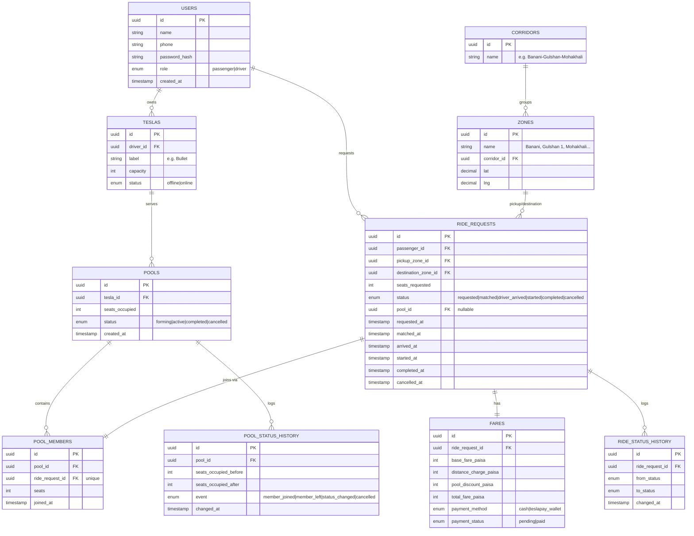

# Dhaka Tesla Pool — Architecture, ERD & Fare Model

This document covers the core design of the MVP: system architecture, database schema (ERD),
the fare model, concurrency handling (seat claims and pool creation), transaction/atomicity
rules, the ride state machine, and the cancellation policy. Everything here is designed to be
explained, defended, and tested by hand — no part of it should be a black box.

This document is kept in sync with `Dhaka_Tesla_Pool_Master_Instructions_v2.pdf`, the
authoritative project spec. If implementation ever diverges from what's written here, update
both in the same change.

Cast used throughout (seed data, tests, demo): **Jashim** (driver) with his Tesla **Bullet**
(3 seats), passengers **Nusrat**, **Rafiq**, **Shirin**.

---

## 1. Architecture

Kept intentionally simple — no microservices, no queues, no Redis. A ride-pooling MVP with
three actors and a handful of state transitions does not need them, and adding them would
only exist to look impressive, which the brief explicitly penalizes.


**Why REST, not GraphQL:** the resource model is shallow and well-known up front — users,
Teslas, ride requests, pools, fares. There's no deep nested-query problem GraphQL solves
better here, and REST is faster to implement, test, and document under the timeline. GraphQL
would be worth revisiting if the frontend needed to compose many different views over the same
data with varying field requirements (e.g. a richer driver dashboard, analytics views) — not
needed for this MVP.

**Why Postgres:** relational integrity and transactional guarantees (`SELECT ... FOR UPDATE`)
are the actual mechanism used to solve the Section 14 concurrency problem — this is a
structural reason, not a default choice. SQLite would be fine for pure local dev but doesn't
give the same story for concurrent-write correctness or a realistic path to read replicas at
scale (Bonus section).

**Why Next.js over plain React:** file-based routing for the three actor-facing flows
(passenger, driver, and implicitly the pool/ride views) without hand-rolling a router, and it
gives a documented, defensible upgrade path to SSR later if needed. Not using any SSR-specific
feature in the MVP itself — this is disclosed honestly in the README rather than dressed up as
something it isn't.

---

## 2. ERD



### Design decisions worth defending in the interview

- **`ZONES` + `CORRIDORS` instead of free-text or raw lat/lng matching.** Section 4 asks for a
  predefined list of Dhaka areas and an explicit, consistently-applied matching rule. A
  corridor groups zones that are "on the way" to each other (e.g. Banani, Gulshan 1, Gulshan 2,
  Mohakhali might share a corridor). The matching rule becomes: **same pickup zone AND same
  destination corridor** — a real SQL join, not string comparison, and it directly models
  Nusrat (→ Mohakhali) and Rafiq (→ Gulshan 1) as compatible without their destinations being
  identical.

- **`seats_occupied` lives on `pools`, not derived by counting `pool_members` on every read.**
  This makes the capacity check during matching a single row read (and lock) rather than an
  aggregate query, which matters directly for the concurrency requirement below.

- **`pool_members.ride_request_id` is unique.** A ride request can only ever belong to one
  pool. This is a real constraint the database enforces, not just application logic that can
  be bypassed by a bug.

- **At most one `forming`/`active` pool per Tesla at a time**, enforced via a partial unique
  index (not expressible in the Mermaid diagram, documented here explicitly):
  ```sql
  CREATE UNIQUE INDEX one_active_pool_per_tesla
    ON pools (tesla_id)
    WHERE status IN ('forming', 'active');
  ```
  This is what actually prevents Jashim's Bullet from somehow running two simultaneous pools.

- **`RIDE_STATUS_HISTORY` and `POOL_STATUS_HISTORY` are separate, both append-only.** A pool's
  lifecycle (forming → active → completed/cancelled) is driven by driver/capacity events, while
  a ride request's lifecycle is driven by an individual passenger's journey. Deriving pool
  status from the states of its member ride requests would mean inferring driver-side events
  from passenger-side data — backwards, and fragile the moment a pool has zero members
  temporarily. Keeping them separate also gives a direct, literal answer to "prove capacity was
  never exceeded, even transiently": show the `POOL_STATUS_HISTORY` rows with timestamps.

- **No standalone `payments` or `ratings` table.** Payment method/status live directly on
  `FARES` since there's no wallet top-up/refund ledger in scope to justify a separate table.
  Ratings are explicitly optional in the brief. Both are noted under "next improvements" in the
  README rather than built now — adding them would be exactly the kind of unjustified schema
  growth the brief penalizes.

### Database-level invariants (enforced by constraints, not just application code)

Data integrity must hold even if application code has a bug — so these are enforced as real
database constraints, not just checked in the service layer:

```sql
-- At most one forming/active pool per Tesla
CREATE UNIQUE INDEX one_active_pool_per_tesla
  ON pools (tesla_id)
  WHERE status IN ('forming', 'active');

-- Seats occupied can never go negative (upper bound checked in application
-- logic against the joined Tesla's capacity at write time, since capacity
-- lives on a different table and can't be expressed in a single-table CHECK)
ALTER TABLE pools ADD CONSTRAINT seats_within_capacity
  CHECK (seats_occupied >= 0);

-- A ride request must ask for at least one seat
ALTER TABLE ride_requests ADD CONSTRAINT positive_seats_requested
  CHECK (seats_requested > 0);

-- A Tesla must have a real, positive seat capacity
ALTER TABLE teslas ADD CONSTRAINT positive_capacity
  CHECK (capacity > 0);
```

`pool_members.ride_request_id` is `UNIQUE` (see table definition above) — a ride request can
never be attached to more than one pool. All foreign keys are enforced by the database, not
assumed by application code. Application-layer and frontend validation are additional layers,
never a substitute for these constraints.

---

## 3. Fare Model

```
passengerFare = baseFare + distanceCharge − poolDiscount
```

**Money is stored as integer paisa** (1 ৳ = 100 poysha/paisa), never as float or decimal.
Floating point introduces rounding drift across repeated arithmetic (discounts, splits,
aggregation over many rides), which is unacceptable for anything resembling money — the
standard practice (same reasoning as storing USD in cents) is to do all arithmetic in the
smallest integer unit and only format to decimal at the display layer.

**Constants (documented, adjustable):**
- `baseFare` = 3000 paisa (৳30 flat pickup fee)
- `perKmRate` = 1500 paisa/km
- `poolDiscount` = 20%, applied **individually per passenger** to their own subtotal — not
  split evenly across the pool. This matters: each passenger only benefits from the portion of
  the discount attributable to their own trip, so someone booking a longer leg doesn't
  subsidize someone else's shorter one.

**Worked example (hand-checkable, using Nusrat and Rafiq's pooled ride):**

| Passenger | Route | Distance | Subtotal (base + distance) | Pool discount (20%) | Total fare |
|---|---|---|---|---|---|
| Nusrat | Banani → Mohakhali | 4 km | 3000 + (4×1500) = 9000 | 1800 | **7200 paisa (৳72)** |
| Rafiq | Banani → Gulshan 1 | 3 km | 3000 + (3×1500) = 7500 | 1500 | **6000 paisa (৳60)** |

**Matching rule (Section 4):** same `pickup_zone_id` AND same `destination corridor_id`.
Applied consistently via the `ZONES`/`CORRIDORS` tables — no special-casing Nusrat and Rafiq's
route in code; any two requests satisfying the rule pool the same way.

**Payment:** `payment_method` on `FARES` is either `cash` or `teslapay_wallet` (a simulated
in-app balance, no real payment gateway). `payment_status` tracks `pending` → `paid`.

---

## 4. Concurrency

There are two distinct races to protect against, not one. Both must be handled.

### 4a. Seat-claim race

Scenario: Bullet has 1 seat left. Nusrat and Shirin both attempt to claim it at nearly the same
instant; both initially observe 1 seat available.

**Solution — pessimistic row lock inside a transaction:**

```sql
BEGIN;
SELECT seats_occupied, capacity
  FROM pools JOIN teslas ON pools.tesla_id = teslas.id
  WHERE pools.id = $1
  FOR UPDATE;
-- app code checks: seats_occupied + requested_seats <= capacity
-- reject + ROLLBACK if the check fails
UPDATE pools SET seats_occupied = seats_occupied + $2 WHERE id = $1;
INSERT INTO pool_members (...) VALUES (...);
INSERT INTO pool_status_history (...) VALUES (...); -- audit trail
COMMIT;
```

`FOR UPDATE` locks the pool row for the duration of the transaction. The second concurrent
request blocks until the first commits, then re-reads the now-updated `seats_occupied` value
and correctly sees the seat is gone — so it's rejected rather than silently overbooking. The
`POOL_STATUS_HISTORY` rows produced by each attempt give a literal, inspectable trace of which
request was serialized first.

### 4b. Pool-creation race

Scenario: Nusrat and Rafiq submit compatible requests within the same instant. Both queries
check "does a compatible forming/active pool already exist for a matching Tesla?" and both see
**no** — so both attempt to create a new pool for the same Tesla.

**A prior existence-check query is not sufficient on its own** — the check-then-act sequence
has the same race window as the seat-claim problem. The real protection is the database
constraint itself:

```sql
-- from Section 2's invariants:
-- CREATE UNIQUE INDEX one_active_pool_per_tesla
--   ON pools (tesla_id) WHERE status IN ('forming', 'active');
```

When two concurrent pool-creation attempts both try to insert a `forming` pool for the same
Tesla, the second insert **fails** the unique constraint rather than silently succeeding. The
application catches that constraint violation and, instead of surfacing an error to the user,
re-queries for the now-existing compatible pool and joins that one — so the second passenger
still gets pooled correctly, just via the pool the first request actually created.

### At larger scale

Both row-locking and the retry-on-conflict pattern above become contention points under high
write volume on popular Teslas/corridors. Documented next step: move to optimistic concurrency
(a `version` column on `pools`, retry-on-conflict) or a reservation queue per Tesla, so writes
aren't serialized behind a single lock — covered further in the scaling/bonus section.

---

## 5. Transactions & Atomicity

Any operation touching more than one piece of related state must run as a single all-or-nothing
transaction — a partial write here is exactly the kind of bug that silently corrupts pool
capacity or ride history. In particular:

- **Joining a pool**: capacity check + membership row + occupancy update + history record — all
  or nothing (Section 4a).
- **Cancelling a pooled ride**: ride status update + membership/occupancy effects + history
  record — see Section 7 below.
- **Any ride state transition**: status update + `ride_status_history` insert, together.

---

## 6. State Transition Policy

Lifecycle: `REQUESTED → MATCHED/ACCEPTED → DRIVER_ARRIVED → STARTED → COMPLETED (+ CANCELLED)`

Transitions are validated against a single allow-list living in one place in the backend
service layer (a ride service) — never accepted as an arbitrary status field update from an API
client. Every successful transition inserts one `ride_status_history` row (status update + the
history insert happen in the same transaction, per Section 5).

**Explicitly rejected transitions** (non-exhaustive, but these must all fail):

| From | To | Rejected because |
|---|---|---|
| STARTED | REQUESTED | Can't rewind an in-progress ride |
| COMPLETED | REQUESTED | Can't reopen a finished ride |
| CANCELLED | STARTED | A cancelled ride is terminal |
| COMPLETED | CANCELLED | A completed ride is terminal |

## 7. Cancellation Policy

- **Passenger cancellation is allowed only while status is** `REQUESTED` **or**
  `MATCHED/ACCEPTED`. Once `DRIVER_ARRIVED` or later, cancellation is rejected — the ride has
  progressed too far to unwind cleanly, and (per Section 4 driver-side UX) the driver is either
  already present or already en route.
- Cancelling a **pooled** ride (one attached to a `pool_id`) removes the corresponding
  `pool_members` row and decrements `pools.seats_occupied` by that ride's seat count, in the
  same transaction as the ride's status update (Section 5) — never as two separate writes.
- Both the `ride_status_history` (→ `cancelled`) and `pool_status_history`
  (`member_left`, with the before/after occupancy) get a row from the same cancellation, so the
  audit trail shows the ride and the pool's occupancy change together.
- A cancellation attempt on a ride that's already `STARTED`, `COMPLETED`, or `CANCELLED` is
  rejected — same allow-list mechanism as Section 6.

## 8. Open assumptions (Section 17)

- Corridors are manually curated for the MVP (a handful of Dhaka areas), not computed from
  real geography — consistent with Section 4's instruction not to fight map APIs.
- A ride request can specify multiple seats (e.g. a passenger booking for themselves + one
  companion) but pooling logic still matches per-request, not per-seat.
